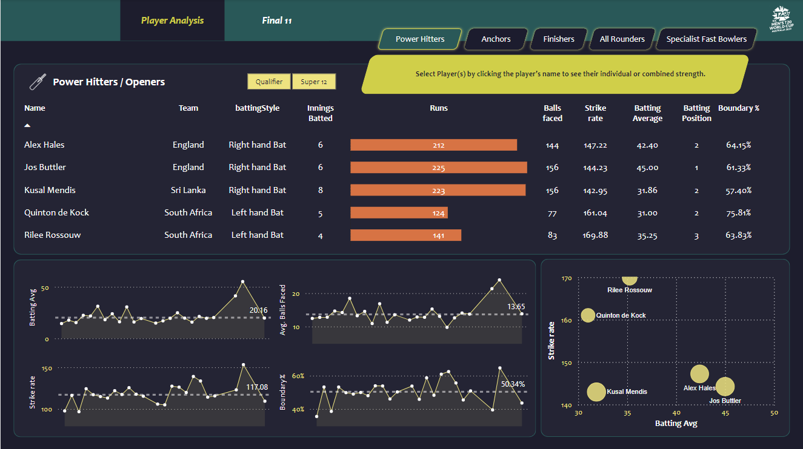

# T20 Best 11 Players Dashboard

## Introduction

Welcome to the **T20 2022 Cricket World Cup Best 11 Players Dashboard**! This project aims to analyze the performance of players from the T20 2022 Cricket World Cup and identify the top 11 players based on various metrics. The dashboard provides an interactive and insightful way to explore the data and make informed decisions.




## Features

- **Interactive Visualization**: Explore the data through interactive charts and graphs.
- **Player Performance Metrics**: Analyze players based on batting, bowling, and fielding performance.
- **Top 11 Players**: Identify the best 11 players using a comprehensive ranking system.

## Dataset

The dataset used for this project includes detailed performance data of players from the T20 2022 Cricket World Cup. The data includes:

- Player Name
- Team
- Matches Played
- Runs Scored
- Wickets Taken
- Catches
- Batting Average
- Bowling Average
- Strike Rate
- Economy Rate
- And other relevant metrics.

## Tools and Technologies

- **Power BI**: For creating interactive visualizations and dashboards.
- **SQL**: For data extraction and manipulation.
- **Python**: For data cleaning, preprocessing, and analysis.
- **Microsoft Azure**: For cloud storage and data processing.

## Installation and Setup

1. **Clone the Repository**:
   ```sh
   git clone https://github.com/yourusername/t20-world-cup-dashboard.git
   cd t20-world-cup-dashboard
2. **Set Up the Environment**:
   ```sh
   pip install -r requirements.txt
3. **Load the Dataset**:
   Place the dataset file (t20_2022_world_cup_data.csv) in the project directory. Ensure the file is named correctly.
4. **Run the Analysis Script**:
   Execute the Python script to preprocess the data and generate insights.
   ```sh
   python analyze_data.py
5. **Launch Power BI**:
   Open the Power BI file (dashboard.pbix) to view and interact with the dashboard.

## Usage

- **Interactive Charts**: Use the interactive charts to filter and explore player performance based on different criteria.
- **Top 11 Players**: View the dynamically generated list of the top 11 players.
- **Detailed Analysis**: Access detailed performance metrics and insights for each player.

## Contributing

We welcome contributions to enhance the functionality and features of this dashboard. If you have suggestions or improvements, please create an issue or submit a pull request.

## License

This project is licensed under the MIT License. See the LICENSE file for more details.

## Contact

For any questions or support, please contact er.sahil.gupta01@gmail.com
    

  
